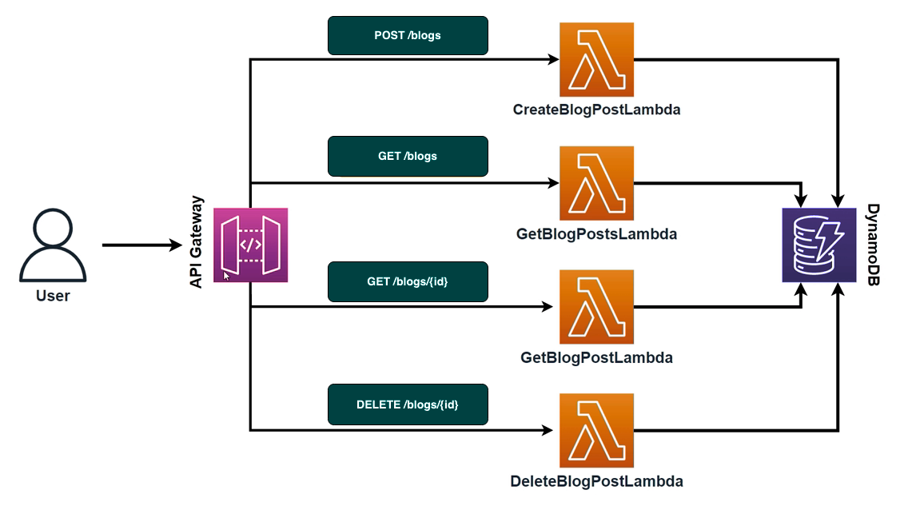

# Serverless Blog CDK
This service helps you manage blog posts using AWS Lambda, API Gateway, and DynamoDB. You can create blog posts, retrieve details of specific posts, get a list of all posts, and delete posts. The API is designed to be scalable, secure, and easy to use with a custom domain and SSL certificate. The entire infrastructure is provisioned using AWS Cloud Development Kit (CDK) as Infrastructure as Code (IaC).

This diagram illustrates the overall architecture of the service. The entry point is the API Gateway, which has four endpoints. Each endpoint triggers a corresponding Lambda function that interacts with DynamoDB.



## Requirements
- Node 20.16.0 LTS
- NPM 10.x
- AWS Credentials (if you wish to deploy to AWS)

## Installation
To make sure you are running the correct node version, you can use nvm.

```
nvm use
```

This should be all you need to do to install the project dependencies.

```
npm install
```

## Deployment
To deploy the service to AWS, you need to have your AWS credentials set up and ensure that on your terminal you are on that profile. You can switch the AWS profile with the following command:

```bash
export  AWS_PROFILE=your-profile
```

Replace your-profile with the profile you have set up in your `~/.aws/credentials` file.

To deploy the service, you can run the following command:

```bash
npm run deploy
```

This will deploy the service to your AWS account.

### Destroying the stack
To destroy the stack, you can run the following command:

```bash
npm run destroy
```

### Testing
To run the unit tests, you can use the following command:

```bash
npm run test
```
